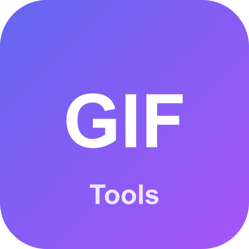

# GIF Tools

<p align="center">
  
</p>

**GIF Tools** — десктопное приложение для редактирования GIF-анимаций и изображений. 16+ встроенных инструментов: от простой обрезки и поворота до продвинутой конвертации и удаления фона.

Работает полностью локально — никаких загрузок на сторонние серверы. Всё обрабатывается на вашем компьютере с помощью **sharp** и **FFmpeg**.

---

## Возможности

| Инструмент | Описание |
|---|---|
| **Resize (Изменить размер)** | Масштабирование GIF и изображений с сохранением пропорций |
| **Crop (Обрезка)** | Интерактивная обрезка по области (поддерживает анимированные GIF) |
| **Rotate (Поворот)** | Поворот на 90°, 180°, 270° или произвольный угол |
| **Effects (Эффекты)** | Ч/б, сепия, размытие, пикселизация, повышение резкости |
| **Speed (Скорость)** | Ускорение/замедление GIF-анимации |
| **Reverse (Реверс)** | Воспроизведение GIF задом наперёд |
| **Optimize (Сжатие)** | Оптимизация размера GIF за счёт уменьшения количества цветов |
| **Cut (Кадры)** | Вырезание диапазона кадров из GIF |
| **Split (Разбить)** | Разделение многостраничного GIF/изображения на отдельные кадры |
| **Add Text (Текст)** | Наложение текста на изображение/GIF: интерактивное размещение кликом, перетаскивание, изменение размера, выбор шрифта, цвета, обводки |
| **Make GIF (Сделать GIF)** | Создание GIF из нескольких загруженных изображений |
| **Video to GIF** | Конвертация видео (MP4, WebM, AVI, MOV) в GIF |
| **Convert (Конвертация)** | GIF ↔ MP4, WebM, PNG, JPG |
| **Remove BG (Удалить фон)** | Удаление фона с изображения (RGB-хрома key) |

## Интерфейс

- Единая страница со списком всех инструментов
- Перетаскивание файлов (drag & drop)
- Предпросмотр результата перед скачиванием
- Адаптивный дизайн на Tailwind CSS v4 + shadcn/ui
- Русскоязычный интерфейс

## Технологии

- **Next.js 16** (App Router, API routes)
- **Tailwind CSS v4** + **shadcn/ui**
- **sharp** — обработка статических изображений
- **FFmpeg** — обработка анимированных GIF и видео
- **Prisma** + **SQLite** — хранение истории/настроек
- **Electron** — десктопная обёртка
- **electron-builder** + **NSIS** — установщик для Windows

## Установка

### Из готового установщика

Скачайте последний релиз `GIF Tools Setup x.x.x.exe` из [Releases](https://github.com/tolyan28rus/gif-tools/releases) и запустите. FFmpeg уже встроен.

### Сборка из исходников

```bash
# Клонирование
git clone https://github.com/tolyan28rus/gif-tools.git
cd gif-tools

# Установка зависимостей
npm install

# Положите ffmpeg.exe в resources/ffmpeg/ffmpeg.exe (скачать с ffmpeg.org)
# или установите в систему (должен быть доступен в PATH)

# Запуск в режиме разработки
npm run dev

# Сборка Electron-приложения и NSIS-установщика
npm run build
npm run electron:build
```

Установщик появится в `dist-electron/`.

## Структура проекта

```
src/
├── app/
│   ├── api/gif/
│   │   ├── upload/route.ts    — загрузка и валидация файлов
│   │   ├── add-text/route.ts   — наложение текста (sharp + SVG)
│   │   ├── convert/route.ts    — конвертация форматов
│   │   ├── crop/route.ts       — обрезка
│   │   ├── cut/route.ts        — вырезание кадров
│   │   ├── effects/route.ts    — эффекты
│   │   ├── make-gif/route.ts   — создание GIF из кадров
│   │   ├── optimize/route.ts   — оптимизация
│   │   ├── remove-bg/route.ts  — удаление фона
│   │   ├── resize/route.ts     — изменение размера
│   │   ├── reverse/route.ts    — реверс
│   │   ├── rotate/route.ts     — поворот
│   │   ├── speed/route.ts      — скорость
│   │   ├── split/route.ts      — разбить на кадры
│   │   └── video-to-gif/route.ts — видео → GIF
│   └── page.tsx               — главная страница (все инструменты)
├── lib/
│   ├── ffmpeg-path.ts          — утилита для вызова FFmpeg
│   └── tools-config.ts         — конфигурация инструментов
├── components/                 — UI-компоненты (shadcn/ui)
electron-main.js                — точка входа Electron
```

## Лицензия

MIT
